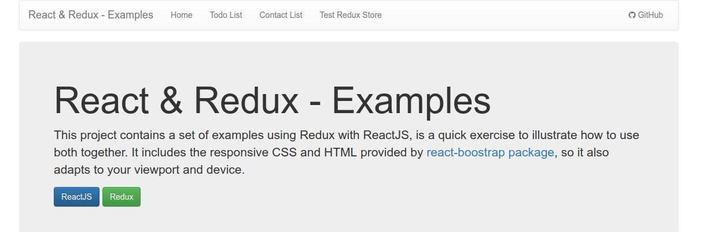

# React & Redux examples

This project contains a set of examples (Todo List and Contact List) using [Redux](https://redux.js.org/) with [ReactJS](https://reactjs.org/), is a quick exercise to illustrate how to use both together. It includes the responsive CSS and HTML provided by [react-boostrap](https://react-bootstrap.github.io/) package, so it also adapts to your viewport and device.

## Create React App
This project was bootstrapped with [Create React App](https://github.com/facebookincubator/create-react-app).

Below you will find some information on how to perform common tasks. 
You can find the most recent guide version [here](https://github.com/facebookincubator/create-react-app/blob/master/packages/react-scripts/template/README.md).

## Installation 
If you would like to download the code and try it for yourself:

1. git clone https://github.com/saulobr88/react-redux-example.git
2. cd react-redux-example
3. yarn install / npm install
4. yarn start / npm start

## Screenshots
more screenshots [here](https://github.com/saulobr88/react-redux-example/tree/master/screenshots)